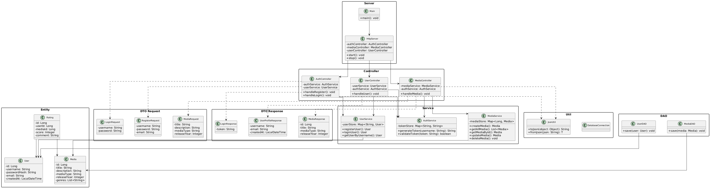

# Entwicklungsprotokoll - Media Ratings Platform
## Finale Abgabe SWEN1

## Projektbeschreibung

Dieses Projekt implementiert einen REST-basierten HTTP-Server für eine Media Ratings Platform. Die finale Abgabe umfasst PostgreSQL-Integration, Benutzerregistrierung, Login mit Token-Authentifizierung und CRUD-Operationen für Medieneinträge.

## Technische Schritte und Architekturentscheidungen

### Architektur

Das Projekt folgt einer Schichtenarchitektur mit klarer Trennung der Verantwortlichkeiten:

- Controller Layer: Verarbeitung der HTTP-Requests und Responses
- Service Layer: Geschäftslogik und Validierung
- Data Access Layer: Datenbankzugriff mit PostgreSQL JDBC
- Entity Layer: Domänenmodelle (User, Media, Rating)

#### UML-Klassendiagramm

Das vollständige UML-Klassendiagramm zeigt alle Klassen, ihre Attribute, Methoden und Beziehungen. Es visualisiert die Schichtenarchitektur mit Entity, DTO (Request/Response), Service, DAO, Controller und Server/Util Packages.

### HTTP-Server

Technologie: Java SE HttpServer (com.sun.net.httpserver.HttpServer)

Entscheidung: Der Java SE HttpServer erfüllt die Anforderung, keine Web-Frameworks wie Spring oder JSP zu verwenden. Er ist Teil der Java-Standardbibliothek und ermöglicht die Implementierung eines reinen HTTP-Servers.

Implementierung: Der Server lauscht auf Port 8080 und nutzt einen Thread Pool für parallele Request-Verarbeitung.

### Authentifizierung

Implementierung: Token-basierte Authentifizierung mit Bearer Token im Authorization-Header

Funktionsweise: Nach erfolgreichem Login erhält der Benutzer einen Token (Format: "username-token-[timestamp]"). Dieser Token wird bei allen geschützten Endpoints im Header "Authorization: Bearer <token>" mitgesendet und validiert.

Token-Speicherung: In-Memory ConcurrentHashMap im AuthService

### Passwort-Sicherheit

Implementierung: SHA-256 Hashing vor Speicherung

Die UserService Klasse hasht alle Passwörter mit SHA-256 vor der Weitergabe an die Datenschicht. Klartext-Speicherung wird verhindert.

### JSON-Verarbeitung

Bibliothek: Jackson ObjectMapper

Jackson wird für die Serialisierung und Deserialisierung von Java-Objekten zu JSON verwendet. Die DTOs nutzen Jackson-Annotationen für die korrekte Feldabbildung.

### Routing

Implementierung: Manuelle Pfad-Analyse in den Controllern

### SOLID-Prinzipien Nachweis

**Single Responsibility Principle (SRP):**
- Jede Klasse hat genau eine Verantwortlichkeit
- Controller: nur HTTP-Handling, Service: nur Business-Logik, DAO: nur Datenbankzugriff, Entity: nur Datenstrukturen

**Open/Closed Principle:**
- DTOs erlauben Erweiterung ohne Entity-Änderung
- Service-Layer kann erweitert werden ohne Controller-Änderung

**Dependency Inversion Principle:**
- Controller hängen von Service-Klassen ab (nicht direkt von DAOs)
- Layered Architecture ermöglicht Austausch der Implementierungen

**Hinweis für Final-Abgabe:** Service-Interfaces sollten noch implementiert werden für vollständige Dependency Inversion.

### Datenschicht

Status: Vollständig implementiert mit PostgreSQL

UserDAO: save(User), findByUsername(String), findById(Long) mit PreparedStatements
MediaDAO: save(Media), findById(Long), findAll(), update(Media), delete(Long) mit JSONB für Genres

Connection-Management: Connection-Pro-Request Pattern verhindert "connection closed" Fehler. JDBC-Treiber explizit geladen mit `Class.forName("org.postgresql.Driver")`.

## Implementierte Komponenten

### REST Endpoints

Benutzer:
- POST /api/users/register - Registrierung neuer Benutzer
- POST /api/users/login - Login und Token-Generierung
- GET /api/users/{username}/profile - Profil-Abfrage (authentifiziert)

Media:
- POST /api/media - Neuen Medieneintrag erstellen (authentifiziert)
- GET /api/media - Alle Medieneinträge abrufen (authentifiziert)
- GET /api/media/{id} - Einzelnen Medieneintrag abrufen (authentifiziert)
- PUT /api/media/{id} - Medieneintrag aktualisieren (authentifiziert)
- DELETE /api/media/{id} - Medieneintrag löschen (authentifiziert)

### Modellklassen

- User: id, username, passwordHash, email, createdAt
- Media: id, title, description, mediaType, releaseYear, genres, ageRestriction
- Rating: id, userId, mediaId, score, comment (Modellklasse vorhanden für spätere Implementierung)

### DTOs

Request: RegisterRequest, LoginRequest, MediaRequest
Response: LoginResponse, UserProfileResponse, MediaResponse

## Unit Tests und Testabdeckung

### Implementierte Tests

JsonUtilTest: Testet JSON-Serialisierung und -Deserialisierung
UserServiceHashTest: Testet Passwort-Hashing (SHA-256)
Entity-Tests: Testen Getter, Setter und Builder
AuthServiceTest: Testet Token-Generierung und -Validierung

### Integrationstests

Bereitgestellt: test-api.bat, test-database.bat, Postman Collection - Testen vollständigen CRUD-Zyklus mit PostgreSQL

## Aufgetretene Probleme und Lösungen

### Problem: Routing ohne Framework

Herausforderung: Java SE HttpServer bietet kein automatisches Routing wie moderne Frameworks.

Lösung: Manuelle Implementierung der Pfad-Analyse in jedem Controller. Pfad-Parameter werden durch String-Split und Pattern-Matching extrahiert.

### Problem: PostgreSQL JDBC-Treiber nicht gefunden

Herausforderung: "No suitable driver found for jdbc:postgresql://..."

Lösung: PostgreSQL-Treiber explizit laden mit `Class.forName("org.postgresql.Driver")` im static-Block + Maven exec:java verwenden

### Problem: "This connection has been closed"

Herausforderung: Singleton-Connection wurde nach erster Verwendung geschlossen (Timeout).

Lösung: Connection-Pro-Request Pattern - jeder DAO-Request erstellt neue Connection, try-with-resources schließt automatisch

### Problem: Genres als Liste in PostgreSQL

Herausforderung: PostgreSQL unterstützt keine nativen Java-Listen.

Lösung: JSONB-Spaltentyp - Jackson ObjectMapper serialisiert List<String> ↔ JSON

### Problem: Token-Persistenz

Herausforderung: In-Memory Token-Speicherung geht bei Server-Neustart verloren.

Lösung: Für die Zwischenabgabe akzeptabel. Die Architektur erlaubt späteren Austausch durch datenbankbasierte Lösung ohne Änderung der Controller.

### Problem: Datenbankintegration

Herausforderung: Vollständige PostgreSQL-Integration ist umfangreich.

Lösung: DAO-Pattern vollständig implementiert. Migration von ConcurrentHashMap zu PostgreSQL erfolgreich. Services nutzen jetzt DAOs, Controller unverändert.

## Zeitaufwand

| Bereich | Tätigkeit | Stunden | Details |
|---------|-----------|---------|---------|
| **Server** | HTTP Server Setup | 3h | Port-Konfiguration, Threading, Request-Handling |
| **Controller** | User Controller | 2.5h | Register, Login, Profile Endpoints |
| **Controller** | Media Controller | 2.5h | CRUD Endpoints, Routing-Logik |
| **Service** | User Service | 2h | Password-Hashing, Validierung |
| **Service** | Media Service | 2h | Business-Logik, Validierung |
| **Auth** | Token-System | 3h | Token-Generierung, Speicherung, Validierung |
| **Model** | Entities & DTOs | 2h | User, Media, Request/Response DTOs |
| **DAO** | DAO Stubs | 1h | Interface-Design, Stub-Implementierung |
| **Tests** | Unit Tests | 2h | Service Tests, Util Tests |
| **Tests** | API Tests | 1h | curl-Skripte, Postman Collection |
| **Doku** | README & Protocol | 2h | Dokumentation, OpenAPI Spec |
| **Database** | PostgreSQL Integration | 4h | Schema-Design, Connection-Setup |
| **DAO** | DAO Implementation | 5h | UserDAO, MediaDAO, JSONB-Mapping |
| **Migration** | Service-Umstellung | 2h | ConcurrentHashMap → DAO |
| **Debugging** | Connection-Probleme | 3h | "closed connection" Fix |
| **Scripts** | Setup-Scripts | 1.5h | Batch-Files, Automatisierung |
| **Doku** | Migration-Doku | 1.5h | Troubleshooting-Guides |
| | **GESAMT** | **38h** | |

## Git Repository

Repository URL: https://github.com/DeeQay/FHTW-SWEN1_MRP

Das Repository enthält den vollständigen Quellcode mit Maven-Konfiguration, PostgreSQL-Schema, Test-Scripts und Postman Collection.

